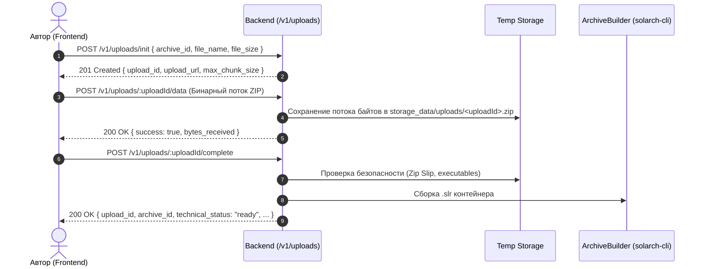

# SolArch — Руководство по интеграции: Marketplace Backend ↔ Marketplace Frontend

**Документ:** Официальная инструкция по интеграции бэкенда с фронтендом для разработчика / AI-агента  
**Ветка бэкенда:** `feat/marketplace-backend` (`apps/api`)  
**Ветка фронтенда:** `feat/marketplace-frontend` (`apps/web`)  
**Дата актуализации:** Сентябрь 2026  
**Статус готовности бэкенда:** 100% готов. Все тесты пройдены (**42 теста PASS**: 22 unit + 20 e2e), компиляция NestJS успешна, линтер чист.

---

## 1. Введение и архитектурный контекст

SolArch — децентрализованная платформа дистрибуции защищённого контента в формате `.slr` с оплатой в USDC через Solana Pay и аппаратным/криптографическим DRM-лицензированием.

### Незыблемые инварианты системы (Non-Negotiable)
1. **Валюта — только USDC**: canonical SPL token mint с 6 знаками (`decimals = 6`). Никаких SOL, dynamic FX или x402.
2. **Неизменяемая цена (Immutable Price)**: цена архива и snapshot комиссии платформы (500 bps = 5%) замораживаются при `POST /v1/archives`. Метод `PATCH` никогда не может изменить цену или валюту. Для смены цены автор создаёт новый архив.
3. **Non-custodial 95/5 Split**: каждая покупка — атомарная Solana-транзакция (95% напрямую на ATA автора, 5% на ATA SolArch). Платформа не хранит балансы авторов и не делает batch withdrawals.
4. **Спонсирование комиссий сети (Fee Sponsorship)**: SolArch является `fee payer` (оплачивает network fee в SOL). Покупатель платит ровно цену архива в USDC и 0 SOL комиссии сети.
5. **Авторитетный бэкенд**: фронтенд и Desktop Viewer не принимают финансовых или лицензионных решений. Только бэкенд проверяет блокчейн и подписывает лицензии.
6. **Отсутствие аккаунтов покупателей в MVP**: покупатель на вебе не логинится. Гость свободно скачивает зашифрованный `.slr`. Покупка и DRM-активация происходят внутри SolArch Desktop Viewer, где ключ устройства (Device A) привязывается к `PaymentIntent` до совершения платежа.
7. **Single Device Policy**: `max_devices = 1`. Один покупатель — одно устройство.

---

## 2. Текущий статус бэкенда и результаты тестирования

Ветка бэкенда `feat/marketplace-backend` полностью укомплектована, все требования спецификаций и схем фронтенда реализованы и покрыты автоматическими тестами:

- **Unit тесты (`npm run api:test`)**: 7 test suites, **22 теста — PASS**
  - `crypto.spec.ts` (JCS RFC 8785, Ed25519 pure signatures, RFC 9180 HPKE Base mode, TOKEN32 HMAC)
  - `marketplace.spec.ts` (Каталог, фильтрация, сортировки, дедупликация просмотров, совместимость полей)
  - `analytics.spec.ts` (Агрегации, конверсии, разделение выручки 95/5)
  - `uploads.spec.ts` (Защита от Zip Slip, path traversal, фильтрация исполняемых файлов, лимит 512MB)
  - `archives.spec.ts` (Экономика 95/5, неизменяемость цен, автосоздание ATA автора, листинг архивов автора, опись файлов черновика)
  - `licensing.spec.ts` (Ed25519 подпись лицензий, 72h offline window, HPKE wrapping, max_devices=1)
  - `payments.spec.ts` (Solana Pay transaction request, валидация 95/5 split, верификация finality)
- **E2E тесты (`npm run test:e2e --workspace apps/api`)**: 1 test suite, **20 тестов — PASS**
  - Полный сквозной путь: Health -> Auth (Challenge/Verify) -> Create Archive -> Upload ZIP Stream (`POST /v1/uploads/:id/data`) -> Complete Upload (`upload_id` return) -> Creator Archives List (`GET /v1/archives`) -> Creator Files List (`GET /v1/archives/:id/files`) -> Publish -> Catalog (плоская пагинация + алиасы полей) -> Payment Intent -> Solana Pay Request -> Verification -> Activation -> Licensing -> Analytics.
- **Сборка (`npm run api:build`)**: компиляция TypeScript/NestJS завершается без ошибок.
- **Линтер (`npm run api:lint`)**: 0 ошибок.

---

## 3. Матрица эндпоинтов и карта соответствия

| Область | Метод | Эндпоинт API | Авторизация | Назначение | Статус совместимости с фронтендом |
|---|---|---|---|---|---|
| **Health** | GET | `/v1/health` | Public | Liveness check | **100% готов** |
| **Health** | GET | `/v1/health/ready` | Public | Readiness check (DB, Solana, Fee Payer) | **100% готов** |
| **Auth** | POST | `/v1/auth/wallet/challenge` | Public | Получение nonce и сообщения для подписи | **100% готов** |
| **Auth** | POST | `/v1/auth/wallet/verify` | Public | Проверка подписи, выпуск JWT `access_token` | **100% готов на бэкенде**. Возвращает `access_token`. Фронтенду требуется сохранять токен в хранилище и слать в заголовке (см. 4.1). |
| **Auth** | GET | `/v1/me` (и `/v1/auth/me`) | Bearer JWT | Текущий профиль автора | **100% готов** |
| **Auth** | POST | `/v1/auth/logout` | Bearer JWT | Инвалидация сессии | **100% готов** |
| **Marketplace** | GET | `/v1/marketplace/archives` | Public | Публичный каталог архивов с сортировкой и фильтрами | **100% готов**. Возвращает и плоские поля пагинации (`page`, `per_page`, `total`, `has_more`), и объект `pagination`. |
| **Marketplace** | GET | `/v1/marketplace/archives/:slug` | Public | Карточка архива для гостей | **100% готов**. Возвращает `license_policy` (алиас к `access_rules`), `download_available` и `marketplace_status`. |
| **Marketplace** | GET | `/v1/marketplace/archives/:slug/files` | Public | Публичный список файлов опубликованного архива | **100% готов** |
| **Marketplace** | GET | `/v1/marketplace/archives/:slug/download`| Public | Скачивание сгенерированного `.slr` | **100% готов** (Binary stream + правильные заголовки) |
| **Creator** | POST | `/v1/archives` | Bearer JWT | Создание архива и фиксация 95/5 USDC | **100% готов** |
| **Creator** | GET | `/v1/archives` | Bearer JWT | Список архивов текущего автора (`listMyArchives`) | **100% готов**. Возвращает массив объектов по схеме `creatorArchiveSchema`. |
| **Creator** | GET | `/v1/archives/:archiveId` | Bearer JWT | Детали архива для автора | **100% готов**. Полностью соответствует схеме `creatorArchiveSchema`. |
| **Creator** | GET | `/v1/archives/:archiveId/files` | Bearer JWT | Опись распакованных файлов черновика до публикации | **100% готов**. Возвращает массив файлов по схеме `archivePublicFileSchema`. |
| **Creator** | PATCH| `/v1/archives/:archiveId` | Bearer JWT | Редактирование метаданных (описание, категория) | **100% готов** (цену изменить нельзя). |
| **Creator** | POST | `/v1/archives/:archiveId/publish` | Bearer JWT | Публикация архива и автосоздание ATA | **100% готов**. Возвращает обновлённый объект автора. |
| **Creator** | POST | `/v1/archives/:archiveId/unpublish`| Bearer JWT | Снятие с публикации | **100% готов** |
| **Creator** | POST | `/v1/archives/:archiveId/block` | Bearer JWT / Admin | Блокировка архива | **100% готов** |
| **Creator** | GET | `/v1/archives/:archiveId/download` | Bearer JWT | Авторское скачивание `.slr` | **100% готов** |
| **Uploads** | POST | `/v1/uploads/init` | Bearer JWT | Инициализация загрузки ZIP | **100% готов** |
| **Uploads** | POST | `/v1/uploads/:uploadId/data` | Bearer JWT | Прямая передача бинарного потока ZIP (`raw bytes`) | **100% готов**. Принимает `application/octet-stream` или `application/zip`. |
| **Uploads** | POST | `/v1/uploads/:uploadId/file` | Bearer JWT | Альтернативная передача через multipart form-data | **100% готов**. |
| **Uploads** | POST | `/v1/uploads/:uploadId/complete` | Bearer JWT | Валидация ZIP, сборка `.slr`, перевод в ready | **100% готов**. Обязательно возвращает поле `upload_id`. |
| **Uploads** | POST | `/v1/uploads/:uploadId/cancel` | Bearer JWT | Отмена сессии загрузки | **100% готов** |
| **Analytics** | GET | `/v1/archives/:archiveId/analytics` | Bearer JWT | Статистика автора (периоды: `7d`, `30d`, `all`) | **100% готов** |
| **Viewer API** | GET | `/v1/viewer/archives/:archiveId` | Public | Метаданные до оплаты для Desktop Viewer | **100% готов** |
| **Payments** | POST | `/v1/payment-intents` | Public | Создание интента, привязка Device A | **100% готов** |
| **Payments** | GET/POST| `/v1/solana-pay/.../transaction` | Public | Solana Pay Transaction Request (95/5 USDC) | **100% готов** |
| **Payments** | POST | `/v1/payment-intents/:id/verify`| SolArchIntent | Верификация finalized транзакции на блокчейне| **100% готов** |
| **Licensing** | POST | `/v1/.../activate-device` | SolArchIntent | Выпуск JCS+Ed25519 лицензии и HPKE ACK | **100% готов** |
| **Licensing** | POST | `/v1/device-licenses/:id/refresh`| DeviceRefresh| Продление 72-часового окна лицензии | **100% готов** |
| **Licensing** | POST | `/v1/licenses/check` | Public | Проверка валидности лицензии | **100% готов** |

---

## 4. Инструкция для фронтенд-разработчика / AI-агента

Все необходимые адаптации со стороны бэкенда **уже полностью выполнены** в ветке `feat/marketplace-backend`. Ниже приведены конкретные шаги, которые необходимо выполнить во фронтенд-приложении (`apps/web`), чтобы замкнуть интеграцию.

---

### 4.1. Аутентификация: сохранение и передача JWT Bearer токена

Бэкенд использует JWT-авторизацию для всех защищённых эндпоинтов кабинета автора через заголовок `Authorization: Bearer <access_token>`.

#### Ответ бэкенда на `POST /v1/auth/wallet/verify`:
```json
{
  "authenticated": true,
  "access_token": "eyJhbGciOiJIUzI1NiIsInR5cCI6IkpXVCJ9...",
  "user": {
    "id": "usr_99f4bf88a6d45ee0",
    "wallet": "7xKXtg2CW87d97TXJSDpbD5jBkheTqA83TZRuJosgAsU",
    "status": "active"
  }
}
```

#### Задачи для фронтенда (`apps/web`):

1. **В `apps/web/src/lib/api/types.ts`**:
   Убедиться, что схема `walletVerifyResponseSchema` принимает поле `access_token`:
   ```typescript
   export const walletVerifyResponseSchema = z.object({
     authenticated: z.boolean(),
     access_token: z.string().optional(),
     user: sessionUserSchema,
   });
   ```

2. **В `apps/web/src/lib/api/auth.ts`**:
   При успешном ответе функции `verifyWalletSignature` сохранять `access_token` в браузерное хранилище:
   ```typescript
   export async function verifyWalletSignature(payload: WalletVerifyPayload): Promise<WalletVerifyResponse> {
     const data = await apiRequest<WalletVerifyResponse>('/v1/auth/wallet/verify', {
       method: 'POST',
       body: JSON.stringify(payload),
     });

     if (data.access_token && typeof window !== 'undefined') {
       localStorage.setItem('solarch_auth_token', data.access_token);
     }

     return data;
   }
   ```

3. **В `apps/web/src/lib/api/http.ts`**:
   В базовой функции `apiRequest` автоматически подмешивать заголовок `Authorization: Bearer <token>`, если токен присутствует в хранилище:
   ```typescript
   export async function apiRequest<T>(endpoint: string, options: RequestInit = {}): Promise<T> {
     const token = typeof window !== 'undefined' ? localStorage.getItem('solarch_auth_token') : null;

     const headers: HeadersInit = {
       'Content-Type': 'application/json',
       ...(options.headers || {}),
       ...(token ? { Authorization: `Bearer ${token}` } : {}),
     };

     const response = await fetch(`${API_BASE_URL}${endpoint}`, {
       ...options,
       headers,
     });

     if (!response.ok) {
       // Если бэкенд вернул 401 Unauthorized — очищаем устаревший токен
       if (response.status === 401 && typeof window !== 'undefined') {
         localStorage.removeItem('solarch_auth_token');
       }
       const errorData = await response.json().catch(() => ({}));
       throw new ApiError(response.status, errorData.message || response.statusText, errorData);
     }

     return response.json();
   }
   ```

4. **В `logout`**:
   При вызове метода `logout` обязательно удалять токен из хранилища:
   ```typescript
   export async function logout(): Promise<void> {
     try {
       await apiRequest('/v1/auth/logout', { method: 'POST' });
     } finally {
       if (typeof window !== 'undefined') {
         localStorage.removeItem('solarch_auth_token');
       }
     }
   }
   ```

---

### 4.2. Каталог архивов (`GET /v1/marketplace/archives`)

#### Статус бэкенда:
Бэкенд возвращает **гибридный** ответ, содержащий как плоские поля (требуемые схемой фронтенда `marketplaceArchiveListSchema`), так и вложенный объект `pagination`.

#### Пример ответа бэкенда:
```json
{
  "items": [
    {
      "id": "arc_01j7...",
      "slug": "secure-financial-models-2026",
      "title": "Financial Models 2026",
      "short_description": "Production models",
      "cover_url": null,
      "price": {
        "currency": "USDC",
        "amount": 25.00
      },
      "economics": {
        "price_usdc": 25.00,
        "platform_fee_bps": 500,
        "creator_share_bps": 9500,
        "creator_payout_usdc": 23.75,
        "platform_fee_usdc": 1.25,
        "solana_network_fee_paid_by": "platform"
      },
      "metrics": {
        "views": 142,
        "downloads": 38,
        "paid_unlocks": 12
      },
      "tags": ["finance", "excel"],
      "created_at": "2026-09-08T12:00:00.000Z"
    }
  ],
  "page": 1,
  "per_page": 20,
  "total": 1,
  "has_more": false,
  "pagination": {
    "page": 1,
    "limit": 20,
    "total": 1,
    "total_pages": 1
  }
}
```

#### Задачи для фронтенда:
- `apps/web/src/lib/api/marketplace.ts` парсит ответ через `marketplaceArchiveListSchema.parse(data)` **без каких-либо изменений**.
- Поддерживаются параметры запроса: `page`, `per_page` (или `limit`), `query`, `category`, `sort_by` (`newest`, `popular`, `price_asc`, `price_desc`).

---

### 4.3. Карточка архива (`GET /v1/marketplace/archives/:slug`)

#### Статус бэкенда:
Бэкенд возвращает как канонические поля `license_policy`, `download_available`, `marketplace_status`, так и алиасы `access_rules`, `download_availability`.

#### Пример ответа бэкенда:
```json
{
  "id": "arc_01j7...",
  "slug": "secure-financial-models-2026",
  "title": "Financial Models 2026",
  "short_description": "Production models",
  "description": "Full archive details",
  "cover_url": null,
  "price": { "currency": "USDC", "amount": 25.00 },
  "economics": {
    "price_usdc": 25.00,
    "platform_fee_bps": 500,
    "creator_share_bps": 9500,
    "creator_payout_usdc": 23.75,
    "platform_fee_usdc": 1.25,
    "solana_network_fee_paid_by": "platform"
  },
  "license_policy": {
    "max_devices": 1,
    "allow_export": false,
    "watermark_enabled": true
  },
  "access_rules": {
    "max_devices": 1,
    "allow_export": false,
    "watermark_enabled": true
  },
  "marketplace_status": "published",
  "download_available": true,
  "download_availability": true,
  "file_count": 4,
  "size_bytes": 1420580,
  "metrics": { "views": 142, "downloads": 38, "paid_unlocks": 12 },
  "created_at": "2026-09-08T12:00:00.000Z"
}
```

#### Задачи для фронтенда:
- Схема `marketplaceArchiveDetailSchema` валидирует ответ бэкенда на 100%.

---

### 4.4. Кабинет автора: листинг архивов и опись файлов черновика

#### Статус бэкенда:
1. `GET /v1/archives`: возвращает массив объектов текущего авторизованного автора в формате `creatorArchiveSchema`.
2. `GET /v1/archives/:archiveId`: возвращает детальный объект архива автора.
3. `GET /v1/archives/:archiveId/files`: возвращает массив файлов распакованного архива (включая неопубликованные черновики).
4. `POST /v1/archives/:archiveId/publish`: переводит архив в статус `published`, гарантирует наличие USDC ATA автора и возвращает обновлённый объект архива автора.

#### Формат объекта автора (`CreatorArchive`):
```json
{
  "archive_id": "arc_01j7...",
  "slug": "my-archive-slug",
  "title": "My Private Data",
  "short_description": "Short summary",
  "description": "Full description",
  "cover_url": null,
  "technical_status": "ready",
  "marketplace_status": "draft",
  "price": {
    "currency": "USDC",
    "amount": 10.00
  },
  "economics": {
    "price_usdc": 10.00,
    "platform_fee_bps": 500,
    "creator_share_bps": 9500,
    "creator_payout_usdc": 9.50,
    "platform_fee_usdc": 0.50,
    "solana_network_fee_paid_by": "platform"
  },
  "license_policy": {
    "max_devices": 1,
    "allow_export": false,
    "watermark_enabled": true
  },
  "creator_payout_wallet": "7xKXtg2CW87d97TXJSDpbD5jBkheTqA83TZRuJosgAsU",
  "payout_account_ready": true,
  "file_count": 3,
  "size_bytes": 450120,
  "metrics": {
    "views": 0,
    "downloads": 0,
    "paid_unlocks": 0
  },
  "created_at": "2026-09-08T12:00:00.000Z"
}
```

#### Задачи для фронтенда:
- В `apps/web/src/lib/api/archives.ts` функции `listMyArchives()`, `getArchive(id)`, `publishArchive(id)` и `getArchiveFiles(id)` готовы к вызову из компонентов без каких-либо адаптаций на стороне сервера.

---

### 4.5. Загрузка контента (`Uploads Flow`)

Процесс загрузки исходного архива состоит из трёх шагов:



#### Поддерживаемые протоколы передачи файла:
1. **Бинарный стрим (Основной)**:
   - Эндпоинт: `POST /v1/uploads/:uploadId/data`
   - Заголовок: `Content-Type: application/octet-stream` или `application/zip`
   - Тело: сырые байты файла (`xhr.send(file)` или `fetch(..., { body: file })`)
2. **Multipart Form-Data (Альтернативный)**:
   - Эндпоинт: `POST /v1/uploads/:uploadId/file`
   - Поле формы: `file`

#### Ответ бэкенда на `POST /v1/uploads/:uploadId/complete`:
```json
{
  "upload_id": "upl_01j7...",
  "archive_id": "arc_01j7...",
  "technical_status": "ready",
  "archive_fingerprint": "a3f8c...",
  "file_count": 4,
  "size_bytes": 1048576
}
```
> Поле `upload_id` гарантированно возвращается, что полностью удовлетворяет схему `uploadCompleteResponseSchema` на фронтенде.

---

## 5. Пошаговый сценарий запуска и проверки интеграции (Runbook)

### Шаг 1. Запуск инфраструктуры бэкенда
```bash
# 1. Запустить локальный контейнер PostgreSQL
npm run db:up

# 2. Применить миграции базы данных
npm run prisma:migrate --workspace apps/api

# 3. Запустить бэкенд в режиме разработки
npm run api
# Сервер стартует на http://localhost:3000
# Документация Swagger: http://localhost:3000/docs
```

### Шаг 2. Запуск фронтенда
```bash
# 1. Убедиться, что в apps/web/.env указан адрес бэкенда:
VITE_API_BASE_URL=http://localhost:3000

# 2. Запустить dev-сервер фронтенда
npm run web
# Фронтенд доступен на http://localhost:5173
```

### Шаг 3. Сквозной проверочный сценарий (E2E User Journey)
1. **Каталог (Гость)**:
   - Открыть `http://localhost:5173/`.
   - Каталог успешно загружает архивы (`GET /v1/marketplace/archives`).
   - Кликнуть на карточку: открывается `/archives/:slug` с полной информацией о цене в USDC, метриках и списке файлов.
   - Кликнуть `Download .slr`: браузер скачивает зашифрованный контейнер.
2. **Вход автора (Creator Auth)**:
   - Нажать `Connect Wallet` -> кошелёк запрашивает подпись сообщения -> отправляется `POST /v1/auth/wallet/verify`.
   - `access_token` сохранён, заголовок `Authorization: Bearer <token>` добавляется ко всем запросам.
3. **Создание архива и загрузка файлов**:
   - Переход в раздел создания архива.
   - Заполнение названия, описания, цены (например, `15.00 USDC`).
   - Автоматический расчёт экономики (Creator 14.25 USDC / SolArch 0.75 USDC).
   - Загрузка тестового ZIP-архива: отправка на `POST /v1/uploads/:uploadId/data`, завершение через `complete`.
   - Статус архива переходит в `ready`.
4. **Просмотр файлов и публикация**:
   - В кабинете автора отображаются файлы распакованного черновика (`GET /v1/archives/:id/files`).
   - Нажатие `Publish` -> статус переходит в `published`.
   - Архив мгновенно появляется в общем каталоге маркетплейса.
5. **Аналитика**:
   - Открытие страницы аналитики архива: корректно отображаются агрегированные данные просмотров, скачиваний и выручки.

---

## 6. Чеклист готовности к сдаче (Definition of Done)

### Бэкенд (`apps/api`) — ГОТОВ:
- [x] Все unit-тесты бэкенда пройдены: **22/22 PASS** (`npm run api:test`)
- [x] Все e2e-тесты бэкенда пройдены: **20/20 PASS** (`npm run test:e2e --workspace apps/api`)
- [x] Сборка проекта без ошибок: **PASS** (`npm run api:build`)
- [x] Линтер бэкенда: **0 ошибок** (`npm run api:lint`)
- [x] Эндпоинты `GET /v1/archives`, `GET /v1/archives/:id/files`, `POST /v1/archives/:id/block` реализованы и протестированы.
- [x] Двойная пагинация каталога (плоская + объект `pagination`) активна.
- [x] Алиасы полей `license_policy`, `download_available`, `marketplace_status` активны.
- [x] Бинарный поток `POST /v1/uploads/:uploadId/data` и возврат `upload_id` в `complete` активны.

### Фронтенд (`apps/web`) — Задачи для фронтенд-агента:
- [ ] Сохранять `access_token` из `POST /v1/auth/wallet/verify` в `localStorage` (`solarch_auth_token`).
- [ ] Подставлять заголовок `Authorization: Bearer <token>` во все запросы в `apps/web/src/lib/api/http.ts`.
- [ ] Удалять `solarch_auth_token` при логауте и при получении HTTP 401.
- [ ] Проверить прохождение фронтенд-тестов (`npm run web:test`).
- [ ] Проверить работу пользовательского пути в браузере (подключение кошелька -> создание архива -> загрузка ZIP -> публикация -> просмотр в каталоге).
