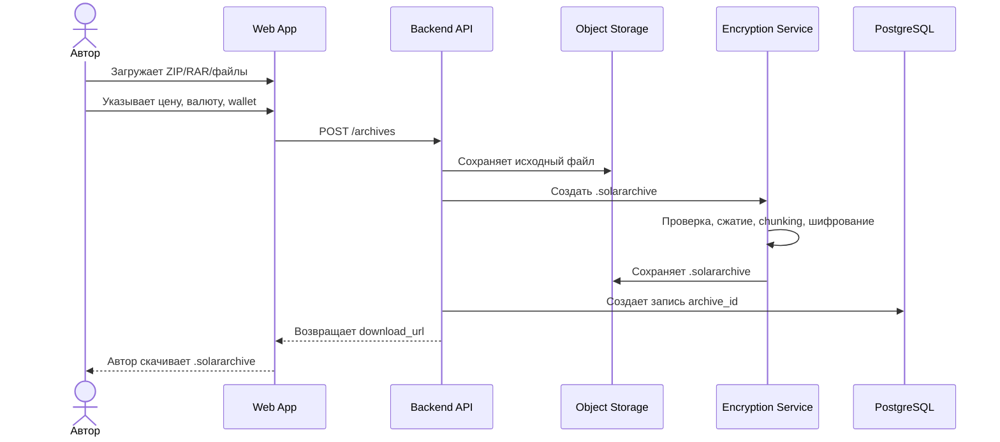
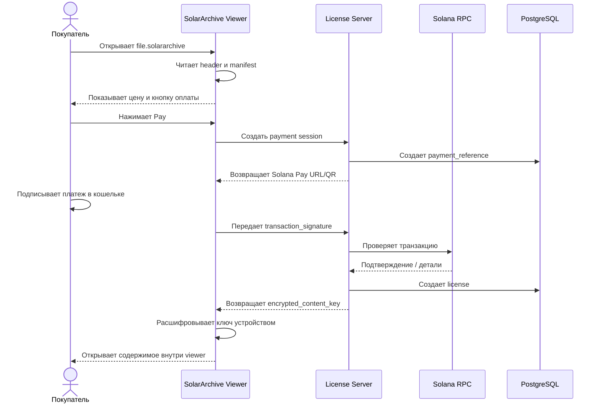
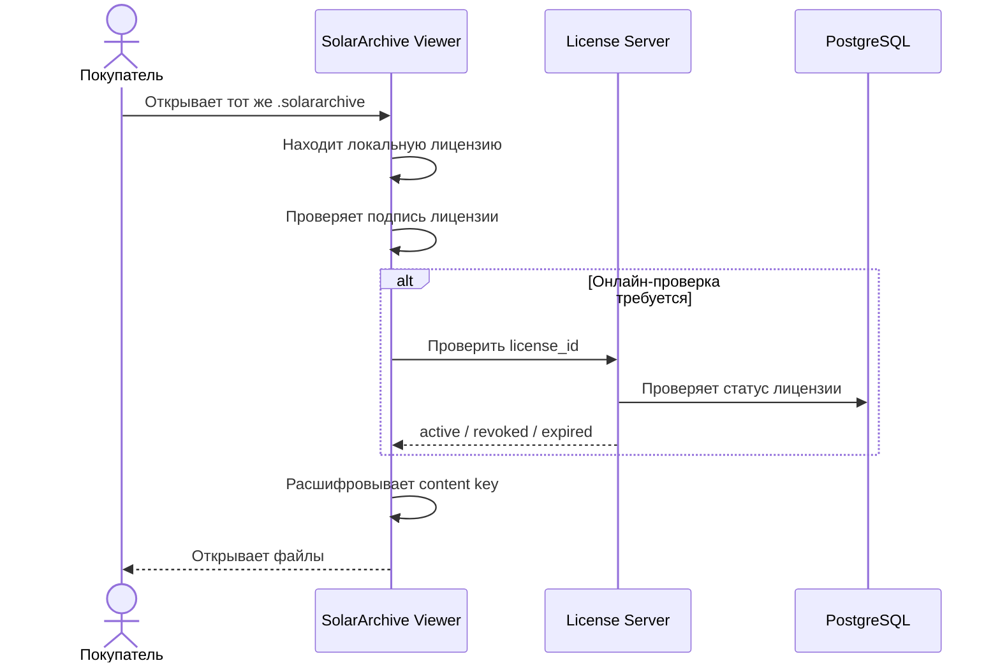
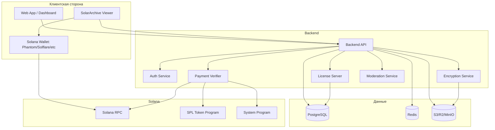
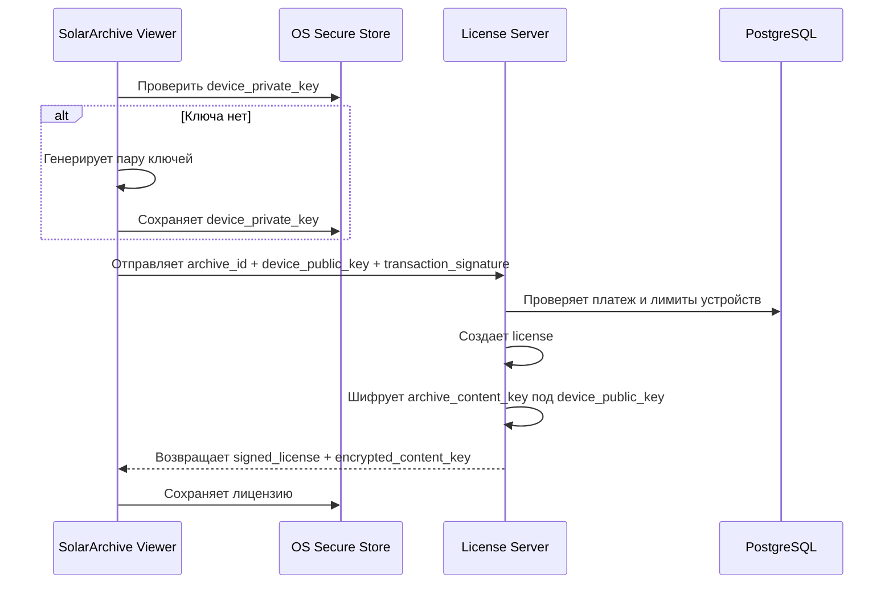
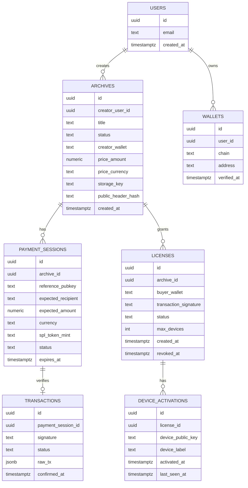

# SolarArchive — техническое описание проекта

**Формат документа:** Markdown  
**Название проекта:** SolarArchive  
**Основное расширение файла:** `.solararchive`  
**Версия документа:** 0.1  
**Дата:** 2026-05-25  
**Язык:** русский  

---

## 1. Краткое описание

**SolarArchive** — это система для создания, распространения и открытия зашифрованных файловых контейнеров с оплатой доступа через сеть **Solana**. Пользователь-автор загружает обычный архив или набор файлов, указывает цену, валюту оплаты и адрес получения средств. Сервис создает защищенный файл с расширением `.solararchive`. Покупатель открывает такой файл через специальное приложение **SolarArchive Viewer**, видит окно оплаты, оплачивает доступ в SOL или USDC, после чего получает лицензию на открытие содержимого.

Важно: `.solararchive` не должен рассматриваться как обычный ZIP/RAR-архив. Это отдельный защищенный контейнер, который объединяет:

- шифрование файлов;
- метаданные платежа;
- проверку транзакции в Solana;
- лицензию, привязанную к устройству;
- встроенный просмотрщик файлов;
- частичную DRM-защиту от копирования и перепродажи.

Цель проекта — создать продукт, который можно описать так:

> SolarArchive = зашифрованный файловый контейнер + Solana Pay + device-bound лицензии + desktop viewer + DRM-подход.

---

## 2. Главная техническая идея

Обычный `.zip` или `.rar` не умеет показывать собственное окно оплаты при открытии в WinRAR, 7-Zip или стандартном архиваторе ОС. Такие форматы поддерживают сжатие, шифрование и пароль, но не исполняют бизнес-логику оплаты.

Поэтому проект должен использовать собственный формат файла:

```text
example.solararchive
```

Этот файл открывается не стандартным архиватором, а приложением:

```text
SolarArchive Viewer
```

При установке SolarArchive Viewer регистрируется как обработчик расширения `.solararchive`. После этого пользователь может дважды нажать на файл, и операционная система откроет его в SolarArchive Viewer.

---

## 3. Что реально сделать, а что нет

| Требование | Реализуемо? | Комментарий |
|---|---:|---|
| Создать свое расширение `.solararchive` | Да | Это обычная регистрация собственного типа файла и собственный формат контейнера. |
| Показывать окно оплаты при открытии | Да | Через SolarArchive Viewer или web-viewer. |
| Принимать оплату в SOL | Да | Через Solana Pay / Solana RPC. |
| Принимать оплату в USDC на Solana | Да | Через SPL Token transfer и проверку mint address. |
| Проверять конкретную транзакцию | Да | По signature, recipient, amount, token mint, reference/memo. |
| Привязать доступ к компьютеру | Да, частично | Лучше через криптографический ключ устройства, а не MAC-адрес. |
| Привязать доступ к MAC-адресу | Технически возможно, но плохо | MAC можно подменить, он меняется, часто рандомизируется. |
| Запретить пересылку `.solararchive` | Частично | Переслать можно, но без лицензии другой человек не откроет. |
| Запретить копирование уже увиденного файла на 100% | Нет | Любой DRM можно обойти, особенно после расшифровки данных на устройстве пользователя. |
| Разрешить просмотр только внутри приложения | Да | Если не отдавать исходные файлы внешним программам. |
| Запретить открытие извлеченного PDF/JPG/DOCX через внешнюю программу | Нет | Если файл уже извлечен, он становится обычным файлом. |
| Полностью защититься от пиратства | Нет | Можно только усложнить утечку и добавить watermark/traceability. |

---

## 4. Основные роли пользователей

### 4.1 Автор / продавец

Автор — человек, который хочет монетизировать архив или набор файлов.

Возможности автора:

- загрузить `.zip`, `.rar`, папку или набор файлов;
- указать цену;
- выбрать валюту оплаты: SOL или USDC;
- указать Solana-адрес для получения платежей;
- задать ограничения доступа;
- скачать готовый `.solararchive`;
- получить ссылку на страницу оплаты/открытия;
- видеть статистику покупок;
- видеть список транзакций;
- отзывать доступ в спорных случаях, если такая функция будет предусмотрена правилами сервиса.

### 4.2 Покупатель / читатель

Покупатель — человек, который получает `.solararchive` и хочет открыть содержимое.

Возможности покупателя:

- открыть `.solararchive` через SolarArchive Viewer;
- увидеть цену, валюту, автора и описание;
- подключить кошелек или оплатить через QR/ deep link;
- получить лицензию после оплаты;
- открыть содержимое внутри приложения;
- повторно открывать архив на активированном устройстве;
- запросить перенос лицензии на новое устройство, если такая политика будет добавлена.

### 4.3 Администратор платформы

Администратор управляет сервисом.

Возможности администратора:

- просматривать загруженные архивы;
- модерировать контент;
- блокировать запрещенный контент;
- просматривать платежные события;
- управлять жалобами;
- управлять лимитами файлов;
- управлять комиссиями сервиса;
- отслеживать подозрительную активность.

---

## 5. Базовый пользовательский сценарий

### 5.1 Создание `.solararchive`



### 5.2 Первое открытие покупателем



### 5.3 Повторное открытие



---

## 6. Рекомендуемый технологический стек

### 6.1 Общий стек

| Компонент | Рекомендуемая технология | Почему |
|---|---|---|
| Web App | Next.js + TypeScript | Удобно для сайта, dashboard, оплаты, wallet UI. |
| Backend API | NestJS + TypeScript | Быстрая разработка, строгая структура, хорошая интеграция с Solana SDK. |
| Desktop App | Tauri + React + TypeScript | Нативное приложение, UI на web-стеке, системная логика на Rust. |
| Core engine | Rust | Шифрование, формат контейнера, парсинг, chunked decryption. |
| Database | PostgreSQL | Надежная реляционная БД для архивов, лицензий, платежей. |
| Cache / Queue | Redis + BullMQ | Очереди шифрования, обработка больших файлов, фоновые задачи. |
| Storage | S3 / Cloudflare R2 / MinIO | Хранение исходников, контейнеров и временных файлов. |
| Solana SDK | `@solana/kit`, `@solana/client`, SPL Token libs | Интеграция с Solana. |
| Smart contracts, если нужны | Rust + Anchor | Для on-chain лицензий, escrow, royalties, NFT-доступа. |

### 6.2 Почему Rust

Rust рекомендуется использовать для:

- формата `.solararchive`;
- парсинга header/manifest;
- шифрования и дешифрования;
- цифровых подписей;
- работы с ключами устройства;
- безопасной обработки файлов;
- chunked decryption;
- CLI-инструментов;
- ядра desktop-приложения.

Рекомендуется создать отдельную библиотеку:

```text
solararchive-core
```

Она должна использоваться в:

- backend encryption service;
- desktop viewer;
- CLI-инструменте;
- тестах совместимости формата.

### 6.3 Почему TypeScript

TypeScript рекомендуется использовать для:

- frontend-сайта;
- dashboard автора;
- backend API;
- платежной логики Solana;
- интеграции с кошельками;
- админ-панели;
- SDK для внешних интеграций.

### 6.4 Почему Tauri

Tauri подходит, потому что позволяет делать desktop-приложения с frontend на JavaScript/TypeScript и application logic на Rust. Официальная документация Tauri описывает поддержку frontend frameworks, кроссплатформенность и Rust-логику приложения.

---

## 7. Архитектура системы



---

## 8. Формат файла `.solararchive`

### 8.1 Общий принцип

`.solararchive` — это бинарный контейнер. Внутри него находятся:

1. magic bytes;
2. версия формата;
3. публичные метаданные;
4. зашифрованный manifest;
5. зашифрованный индекс файлов;
6. зашифрованные чанки данных;
7. подпись контейнера;
8. опциональные preview-метаданные.

### 8.2 Возможная структура файла

```text
+------------------------------+
| Magic bytes: SOLARARCHIVE    |
+------------------------------+
| Format version               |
+------------------------------+
| Header length                |
+------------------------------+
| Public header                |
+------------------------------+
| Encrypted manifest           |
+------------------------------+
| Chunk table                  |
+------------------------------+
| Encrypted data chunks        |
+------------------------------+
| Signature block              |
+------------------------------+
```

### 8.3 Magic bytes

Пример:

```text
53 4F 4C 41 52 41 52 43 48 49 56 45
```

ASCII:

```text
SOLARARCHIVE
```

### 8.4 Public header

Public header можно хранить в CBOR, MessagePack или JSON. Для MVP проще начать с JSON, но для продакшена лучше CBOR/MessagePack.

Пример public header:

```json
{
  "format": "solararchive",
  "version": "1.0.0",
  "archive_id": "arc_01HZ...",
  "created_at": "2026-05-25T12:00:00Z",
  "title": "Private course archive",
  "description": "Paid archive protected by SolarArchive",
  "creator_wallet": "CREATOR_SOLANA_PUBLIC_KEY",
  "payment": {
    "currency": "USDC",
    "network": "solana-mainnet",
    "amount": "10.00",
    "recipient": "CREATOR_SOLANA_PUBLIC_KEY",
    "spl_token_mint": "EPjFWdd5AufqSSqeM2qN1xzybapC8G4wEGGkZwyTDt1v"
  },
  "license_policy": {
    "max_devices": 1,
    "offline_grace_period_hours": 72,
    "allow_export": false,
    "allow_external_open": false,
    "watermark": true
  },
  "crypto": {
    "manifest_algorithm": "xchacha20-poly1305",
    "content_algorithm": "xchacha20-poly1305",
    "chunk_size": 1048576,
    "key_wrapping": "x25519-sealed-box-or-equivalent"
  },
  "server": {
    "license_url": "https://api.solararchive.app/v1/licenses",
    "payment_url": "https://api.solararchive.app/v1/payments"
  }
}
```

### 8.5 Encrypted manifest

Manifest содержит чувствительные данные:

- полный список файлов;
- размер каждого файла;
- MIME type;
- hash каждого файла;
- chunk map;
- правила доступа по файлам;
- watermark policy;
- права на preview.

Пример расшифрованного manifest:

```json
{
  "archive_id": "arc_01HZ...",
  "files": [
    {
      "file_id": "file_001",
      "path": "course/lesson-01.pdf",
      "display_name": "lesson-01.pdf",
      "mime_type": "application/pdf",
      "size": 2452344,
      "sha256": "...",
      "chunks": [0, 1, 2],
      "viewer_policy": {
        "internal_viewer_only": true,
        "export_allowed": false,
        "print_allowed": false,
        "copy_text_allowed": false,
        "watermark_required": true
      }
    }
  ]
}
```

---

## 9. Шифрование и ключи

### 9.1 Главный принцип

Ключ расшифровки нельзя хранить внутри `.solararchive` в открытом виде.

Правильная модель:

```text
.solararchive содержит зашифрованные данные
сервер хранит или может выдать content key только после оплаты
лицензия привязана к устройству
```

### 9.2 Иерархия ключей

```text
Archive Master Key / Content Key
        ↓
File Keys или Chunk Keys
        ↓
Encrypted chunks
```

Пример:

- `archive_content_key` — основной ключ архива;
- `file_key` — ключ конкретного файла, производный от archive key;
- `chunk_nonce` — nonce для каждого чанка;
- `license_key` — ключ лицензии для конкретного устройства;
- `device_public_key` — публичный ключ устройства;
- `device_private_key` — приватный ключ устройства, хранится локально.

### 9.3 Рекомендуемые алгоритмы

Для MVP:

- AEAD: `XChaCha20-Poly1305` или `AES-256-GCM`;
- подписи: `Ed25519`;
- key agreement: `X25519`;
- hashes: `SHA-256` или `BLAKE3`;
- KDF: `HKDF`;
- password fallback, если когда-нибудь понадобится: `Argon2id`.

Важно: не писать собственную криптографию с нуля. Использовать проверенные библиотеки.

### 9.4 Chunked encryption

Для больших архивов нельзя расшифровывать весь контейнер целиком. Нужно использовать чанки.

Пример:

```text
chunk_size = 1 MB или 4 MB
file.pdf -> chunk_0001, chunk_0002, chunk_0003
каждый chunk шифруется отдельно
```

Преимущества:

- быстрее открывать большие файлы;
- можно стримить видео/аудио;
- можно расшифровывать только нужную часть;
- меньше данных находится в памяти одновременно;
- проще возобновлять операции.

### 9.5 Защита ключей на устройстве

Приватный ключ устройства должен храниться в защищенном хранилище ОС:

- Windows: DPAPI / Windows Credential Manager / TPM, если доступен;
- macOS: Keychain / Secure Enclave, если доступен;
- Linux: Secret Service / GNOME Keyring / KWallet / TPM, если доступен.

Нельзя хранить приватный ключ в обычном JSON-файле без защиты.

---

## 10. Device-bound лицензирование

### 10.1 Почему не MAC-адрес

MAC-адрес не подходит как надежный идентификатор лицензии:

- его можно подменить;
- у устройства может быть несколько сетевых адаптеров;
- он может меняться при смене сети/адаптера;
- современные ОС используют рандомизацию MAC для приватности;
- браузер обычно не дает доступ к настоящему MAC-адресу;
- хранить MAC в публичном блокчейне плохо с точки зрения приватности.

### 10.2 Правильная модель устройства

При первом запуске SolarArchive Viewer генерирует пару ключей:

```text
device_private_key
device_public_key
```

`device_private_key` остается только на устройстве. Сервер получает только `device_public_key`.

### 10.3 Активация лицензии



### 10.4 Содержимое лицензии

Пример лицензии:

```json
{
  "license_id": "lic_01HZ...",
  "archive_id": "arc_01HZ...",
  "buyer_wallet": "BUYER_SOLANA_PUBLIC_KEY",
  "transaction_signature": "SOLANA_TX_SIGNATURE",
  "device_public_key": "DEVICE_PUBLIC_KEY",
  "created_at": "2026-05-25T12:30:00Z",
  "expires_at": null,
  "status": "active",
  "rights": {
    "open": true,
    "export": false,
    "print": false,
    "copy_text": false,
    "offline_grace_period_hours": 72
  },
  "server_signature": "ED25519_SIGNATURE"
}
```

### 10.5 Offline mode

Полностью требовать интернет при каждом открытии неудобно. Рекомендуется гибридный подход:

- после первой оплаты приложение сохраняет подписанную лицензию;
- приложение может открывать архив офлайн ограниченное время;
- например, `offline_grace_period_hours = 72`;
- после истечения периода нужна онлайн-проверка;
- если лицензия отозвана, доступ блокируется.

---

## 11. Платежная логика Solana / USDC

### 11.1 Общий принцип

Покупатель оплачивает доступ через Solana. Система должна проверять платеж **на backend**, а не только на frontend.

Проверять нужно:

- подпись транзакции (`transaction_signature`);
- получателя (`recipient`);
- сумму (`amount`);
- валюту (`SOL` или SPL token);
- mint address для USDC;
- `reference` или `memo` платежа;
- статус подтверждения;
- отсутствие повторного использования платежа для другого архива.

### 11.2 Solana Pay Transfer Request

Для MVP можно использовать Solana Pay Transfer Request.

Платежная ссылка содержит:

- `recipient`;
- `amount`;
- `reference`;
- `label`;
- `message`;
- `memo`;
- `spl-token`, если это USDC или другой SPL-токен.

`reference` должен быть уникальным для каждой сессии оплаты.

### 11.3 Оплата SOL

Для SOL проверяется обычный transfer на адрес автора или платформы.

Проверка:

```text
transaction contains SystemProgram transfer
recipient == expected_recipient
amount_lamports == expected_amount_lamports
reference is present
finality >= confirmed/finalized
```

### 11.4 Оплата USDC

Для USDC проверяется SPL Token transfer.

Проверка:

```text
instruction == SPL Token transfer / transferChecked
mint == official USDC mint on Solana
recipient token account belongs to expected recipient
amount == expected amount with correct decimals
reference is present
finality >= confirmed/finalized
```

На Solana mainnet mint address нативного USDC обычно:

```text
EPjFWdd5AufqSSqeM2qN1xzybapC8G4wEGGkZwyTDt1v
```

Перед production-запуском это значение нужно дополнительно зафиксировать в конфигурации и проверять по официальным источникам.

### 11.5 Direct payment vs platform custody

Есть два варианта движения средств.

#### Вариант A: платеж напрямую автору

```text
Buyer -> Creator Wallet
```

Плюсы:

- платформа не хранит деньги;
- проще с точки зрения доверия;
- автор получает средства сразу.

Минусы:

- сложнее брать комиссию платформы;
- сложнее делать возвраты;
- сложнее dispute flow.

#### Вариант B: платеж на платформу, затем payout автору

```text
Buyer -> Platform Wallet -> Creator Wallet
```

Плюсы:

- можно брать комиссию;
- можно делать escrow;
- можно управлять возвратами.

Минусы:

- появляются юридические и регуляторные риски;
- платформа становится посредником средств;
- нужен payout-модуль;
- нужен учет балансов.

#### Вариант C: Solana Pay Transaction Request с несколькими инструкциями

Можно создать транзакцию, где часть суммы идет автору, часть — платформе. Это сложнее, но потенциально лучше для комиссии.

Для MVP рекомендуется начать с варианта A или C, избегая хранения пользовательских средств платформой.

---

## 12. License Server

License Server — ключевой компонент системы. Он отвечает за выдачу прав доступа.

### 12.1 Основные функции

- создать payment session;
- хранить ожидаемую сумму и recipient;
- проверять Solana-транзакцию;
- не допускать повторного использования одной транзакции;
- проверять лимит устройств;
- выдавать signed license;
- шифровать content key под device key;
- отзывать лицензию;
- возвращать статус лицензии.

### 12.2 Почему нельзя выдавать ключ с клиента

Frontend можно модифицировать. Поэтому нельзя доверять клиенту в вопросах:

- “платеж прошел”;
- “сумма правильная”;
- “recipient правильный”;
- “это тот архив”;
- “можно выдать ключ”.

Все эти проверки должен делать backend.

---

## 13. Внутренний просмотрщик файлов

### 13.1 Зачем нужен внутренний viewer

Если открыть файл во внешней программе, например PDF в Adobe Reader, то контроль почти теряется. Внешней программе нужно передать обычный расшифрованный файл, а значит пользователь может сохранить, скопировать или перехватить его.

Поэтому для DRM-подхода нужно открывать файлы внутри SolarArchive Viewer.

### 13.2 Минимальный набор viewers для MVP

Рекомендуемый MVP:

| Тип файла | Поддержка в MVP | Комментарий |
|---|---:|---|
| PDF | Да | Самый важный формат для документов, курсов, гайдов. |
| Images: PNG/JPG/WebP | Да | Относительно просто реализовать. |
| Text / Markdown / Code | Да | Удобно для документации и исходников. |
| Video MP4 | Позже | Нужно продумать стриминг чанков. |
| Audio MP3/WAV | Позже | Аналогично видео, но проще. |
| DOCX/XLSX/PPTX | Позже | Сложно качественно отображать без внешних программ. |
| 3D/CAD/PSD | Не MVP | Сложные специализированные форматы. |

### 13.3 Политики просмотра

Пример политик:

```json
{
  "internal_viewer_only": true,
  "allow_export": false,
  "allow_print": false,
  "allow_copy_text": false,
  "allow_screenshot": "best_effort",
  "watermark": {
    "visible": true,
    "text": "{buyer_wallet} | {license_id}",
    "opacity": 0.15
  }
}
```

Важно: запрет скриншотов на десктопе работает только частично и зависит от ОС. Нельзя обещать абсолютную защиту от записи экрана.

---

## 14. Защита от копирования и перепродажи

### 14.1 Что можно сделать

- Привязать лицензию к устройству.
- Привязать лицензию к wallet покупателя.
- Не хранить ключ в `.solararchive`.
- Открывать файлы только внутри viewer.
- Использовать watermark.
- Не создавать постоянные расшифрованные файлы на диске.
- Расшифровывать данные чанками.
- Хранить временные данные в памяти.
- Обфусцировать части desktop-приложения.
- Подписывать приложение.
- Добавить anti-debugging только как дополнительную меру, не как основную защиту.
- Вести аудит подозрительных активаций.
- Ограничить число устройств.

### 14.2 Что нельзя гарантировать

Нельзя гарантировать, что пользователь, который уже получил доступ к данным, никогда не сможет:

- сделать скриншот;
- записать экран;
- сфотографировать монитор;
- извлечь данные из памяти;
- модифицировать приложение;
- использовать виртуальную машину;
- передать устройство другому человеку.

DRM — это не абсолютная защита, а набор барьеров и механизмов отслеживания.

### 14.3 Watermarking

Watermark должен быть индивидуальным для покупателя.

Пример видимого watermark:

```text
Wallet: 8x3...F9a | License: lic_01HZ... | TX: 5gN...Qp2
```

Пример скрытого watermark:

- metadata в PDF;
- невидимые слои;
- изменение порядка объектов;
- steganographic markers для изображений;
- вставка license ID в экспортируемые preview-данные.

Watermark не предотвращает копирование, но позволяет понять, кто слил файл.

---

## 15. API проекта

### 15.1 Auth API

```http
POST /v1/auth/wallet/challenge
POST /v1/auth/wallet/verify
POST /v1/auth/logout
GET  /v1/me
```

Wallet auth может использовать подпись сообщения кошельком.

### 15.2 Archives API

```http
POST   /v1/archives
GET    /v1/archives/:archive_id
GET    /v1/archives/:archive_id/download
PATCH  /v1/archives/:archive_id
DELETE /v1/archives/:archive_id
```

Пример создания архива:

```json
{
  "title": "Private Course",
  "description": "Paid educational archive",
  "creator_wallet": "...",
  "price": {
    "currency": "USDC",
    "amount": "10.00"
  },
  "license_policy": {
    "max_devices": 1,
    "allow_export": false,
    "offline_grace_period_hours": 72
  }
}
```

### 15.3 Upload API

```http
POST /v1/uploads/init
PUT  /v1/uploads/:upload_id/part/:part_number
POST /v1/uploads/:upload_id/complete
POST /v1/uploads/:upload_id/cancel
```

Для больших файлов нужен multipart upload.

### 15.4 Payment API

```http
POST /v1/payments/session
GET  /v1/payments/session/:payment_session_id
POST /v1/payments/verify
```

Пример создания payment session:

```json
{
  "archive_id": "arc_01HZ...",
  "buyer_wallet": "BUYER_WALLET_OPTIONAL",
  "device_public_key": "DEVICE_PUBLIC_KEY"
}
```

Ответ:

```json
{
  "payment_session_id": "pay_01HZ...",
  "reference": "REFERENCE_PUBLIC_KEY",
  "recipient": "CREATOR_WALLET",
  "amount": "10.00",
  "currency": "USDC",
  "spl_token_mint": "EPjFWdd5AufqSSqeM2qN1xzybapC8G4wEGGkZwyTDt1v",
  "solana_pay_url": "solana:..."
}
```

### 15.5 License API

```http
POST /v1/licenses/activate
GET  /v1/licenses/:license_id
POST /v1/licenses/check
POST /v1/licenses/revoke
POST /v1/licenses/transfer-request
```

Пример активации:

```json
{
  "archive_id": "arc_01HZ...",
  "payment_session_id": "pay_01HZ...",
  "transaction_signature": "...",
  "buyer_wallet": "...",
  "device_public_key": "...",
  "app_version": "1.0.0"
}
```

Ответ:

```json
{
  "license": {
    "license_id": "lic_01HZ...",
    "archive_id": "arc_01HZ...",
    "status": "active",
    "rights": {
      "open": true,
      "export": false,
      "print": false
    },
    "server_signature": "..."
  },
  "encrypted_content_key": "BASE64..."
}
```

---

## 16. База данных

### 16.1 Основные таблицы



### 16.2 Таблица archives

Пример полей:

```sql
CREATE TABLE archives (
    id UUID PRIMARY KEY,
    creator_user_id UUID NOT NULL,
    title TEXT NOT NULL,
    description TEXT,
    status TEXT NOT NULL,
    creator_wallet TEXT NOT NULL,
    price_currency TEXT NOT NULL,
    price_amount NUMERIC(38, 18) NOT NULL,
    spl_token_mint TEXT,
    storage_key TEXT NOT NULL,
    content_key_ref TEXT NOT NULL,
    public_header_hash TEXT NOT NULL,
    max_devices INT NOT NULL DEFAULT 1,
    allow_export BOOLEAN NOT NULL DEFAULT FALSE,
    offline_grace_period_hours INT NOT NULL DEFAULT 72,
    created_at TIMESTAMPTZ NOT NULL DEFAULT now(),
    updated_at TIMESTAMPTZ NOT NULL DEFAULT now()
);
```

### 16.3 Таблица payment_sessions

```sql
CREATE TABLE payment_sessions (
    id UUID PRIMARY KEY,
    archive_id UUID NOT NULL REFERENCES archives(id),
    buyer_wallet TEXT,
    device_public_key TEXT,
    reference_pubkey TEXT NOT NULL UNIQUE,
    expected_recipient TEXT NOT NULL,
    expected_amount NUMERIC(38, 18) NOT NULL,
    currency TEXT NOT NULL,
    spl_token_mint TEXT,
    status TEXT NOT NULL,
    expires_at TIMESTAMPTZ NOT NULL,
    created_at TIMESTAMPTZ NOT NULL DEFAULT now()
);
```

### 16.4 Таблица licenses

```sql
CREATE TABLE licenses (
    id UUID PRIMARY KEY,
    archive_id UUID NOT NULL REFERENCES archives(id),
    buyer_wallet TEXT,
    transaction_signature TEXT NOT NULL UNIQUE,
    status TEXT NOT NULL,
    rights JSONB NOT NULL,
    max_devices INT NOT NULL DEFAULT 1,
    created_at TIMESTAMPTZ NOT NULL DEFAULT now(),
    expires_at TIMESTAMPTZ,
    revoked_at TIMESTAMPTZ
);
```

---

## 17. Desktop-приложение SolarArchive Viewer

### 17.1 Основные функции

- регистрация расширения `.solararchive`;
- открытие контейнера двойным кликом;
- чтение public header;
- отображение информации об архиве;
- генерация/хранение device key;
- оплата через кошелек/QR/deep link;
- активация лицензии;
- проверка локальной лицензии;
- расшифровка чанков;
- просмотр файлов внутри приложения;
- watermark;
- настройка лимитов и кеша;
- обновление приложения.

### 17.2 Рекомендуемая структура приложения

```text
solararchive-viewer/
  src-tauri/
    src/
      main.rs
      commands/
        open_archive.rs
        device_key.rs
        license.rs
        crypto.rs
      secure_store/
      file_association/
  src/
    app/
    components/
    pages/
      OpenArchive.tsx
      Payment.tsx
      Viewer.tsx
      Settings.tsx
    lib/
      api.ts
      wallet.ts
      license.ts
```

### 17.3 Регистрация расширения файла

При установке приложение должно зарегистрировать:

```text
.solararchive -> SolarArchive Viewer
MIME type: application/x-solararchive
Icon: SolarArchive icon
Open command: solararchive-viewer "%1"
```

### 17.4 Локальное хранилище

Приложение может хранить:

- device private key — только в secure store;
- signed licenses — локально, но с проверкой подписи;
- cache preview — опционально, зашифрованно;
- настройки пользователя;
- логи без чувствительных данных.

---

## 18. Web App / Dashboard

### 18.1 Страницы

- Landing page;
- Login with wallet;
- Dashboard автора;
- Create archive;
- Upload progress;
- Archive settings;
- Archive analytics;
- Payment sessions;
- Licenses;
- Abuse reports;
- Documentation;
- Download SolarArchive Viewer.

### 18.2 Create archive UI

Поля:

- название;
- описание;
- файл/папка;
- цена;
- валюта;
- адрес получения;
- максимальное число устройств;
- разрешить/запретить экспорт;
- watermark;
- срок действия лицензии;
- офлайн-период;
- публичный preview;
- категория контента.

### 18.3 Analytics

Автору можно показывать:

- число скачиваний `.solararchive`;
- число открытий;
- число оплат;
- conversion rate;
- суммарную выручку;
- валюту платежей;
- список transaction signatures;
- активированные устройства;
- заблокированные лицензии.

---

## 19. Backend services

### 19.1 API Gateway / Backend API

Отвечает за:

- REST/GraphQL API;
- auth;
- rate limits;
- валидацию запросов;
- связь с DB/storage/queue;
- выдачу подписанных URL для upload/download;
- управление архивами и лицензиями.

### 19.2 Encryption Service

Отвечает за:

- распаковку исходного ZIP/RAR, если нужно;
- проверку файлов;
- нормализацию путей;
- защиту от path traversal;
- сжатие;
- chunking;
- шифрование;
- создание manifest;
- создание `.solararchive`;
- расчет hash;
- подпись контейнера.

### 19.3 Payment Verifier

Отвечает за:

- подключение к Solana RPC;
- поиск транзакции по reference;
- проверку recipient;
- проверку amount;
- проверку mint для USDC;
- проверку memo/reference;
- проверку finality;
- защиту от replay attack;
- запись transaction status в БД.

### 19.4 License Server

Отвечает за:

- выдачу лицензии;
- device-bound encryption content key;
- проверку лимитов устройств;
- проверку revoke status;
- периодическую онлайн-валидацию;
- перенос лицензий между устройствами.

---

## 20. Модерация и безопасность контента

Такой сервис может быть использован злоумышленниками, поэтому обязательно нужны правила и ограничения.

### 20.1 Запрещенные сценарии

Нельзя делать функциональность, которая:

- шифрует файлы на компьютере пользователя без его согласия;
- блокирует чужие данные с требованием оплаты;
- маскируется под обычный документ, но запускает вредоносный код;
- распространяет malware;
- используется для вымогательства;
- распространяет украденные данные;
- нарушает авторские права.

### 20.2 Безопасная продуктовая формулировка

Проект должен позиционироваться как:

```text
Платформа для легальной монетизации собственных файлов и архивов.
```

Не как:

```text
Инструмент для блокировки чужих файлов до оплаты.
```

### 20.3 Модерационные меры

- лимиты размера файла;
- антивирусная проверка загружаемых файлов;
- запрет исполняемых файлов в MVP;
- жалобы пользователей;
- takedown-процедуры;
- KYC/KYB для крупных продавцов, если понадобится;
- блокировка нарушителей;
- аудит suspicious behavior.

---

## 21. Threat model

### 21.1 Основные угрозы

| Угроза | Риск | Митигирующие меры |
|---|---|---|
| Пользователь пересылает `.solararchive` | Средний | Device-bound лицензии, max_devices, license server. |
| Пользователь извлекает ключ из приложения | Высокий | Не хранить ключ в файле, secure store, obfuscation, server-side licensing. |
| Пользователь записывает экран | Высокий | Watermark, audit, visible buyer ID. |
| Подмена frontend-логики оплаты | Высокий | Проверка платежа только на backend. |
| Повторное использование одной транзакции | Высокий | Unique reference, transaction_signature UNIQUE. |
| Поддельный recipient/amount | Высокий | Проверять recipient, amount, mint на backend. |
| Компрометация storage | Высокий | Файлы зашифрованы, ключи отдельно. |
| Утечка content key из БД | Критический | KMS/HSM, envelope encryption, strict access. |
| Path traversal при распаковке | Высокий | Нормализация путей, sandbox extraction. |
| Malware в загружаемых архивах | Высокий | AV scanning, запрет executable, moderation. |
| RPC сбои Solana | Средний | Несколько RPC providers, retry, caching. |
| Злоупотребления авторами | Высокий | Terms, reports, moderation, seller reputation. |

### 21.2 Trust boundaries

```text
Desktop App не полностью доверенная среда.
Frontend не доверенная среда.
Backend доверенный, но должен быть hardened.
Storage не должен видеть открытый контент без ключей.
Blockchain является источником платежных фактов, но транзакции нужно валидировать.
```

---

## 22. Roadmap разработки

### 22.1 Phase 0 — Research & Prototype

Цель: доказать, что формат и payment flow работают.

Задачи:

- описать `.solararchive` v0;
- сделать CLI encrypt/decrypt;
- сделать тестовый backend verify payment;
- создать demo payment session в devnet;
- проверить открытие файла в Tauri app;
- сделать простую лицензию без сложного DRM.

Результат:

```text
Можно создать .solararchive, оплатить в devnet и открыть содержимое.
```

### 22.2 Phase 1 — MVP

Цель: запустить минимально рабочий продукт.

Функции:

- dashboard автора;
- upload ZIP/RAR;
- создание `.solararchive`;
- цена в SOL/USDC;
- SolarArchive Viewer для Windows/macOS;
- device-bound license;
- просмотр PDF/images/text внутри приложения;
- payment verification;
- локальная signed license;
- basic watermark;
- админка;
- basic moderation.

### 22.3 Phase 2 — Security & Production

Функции:

- code signing приложений;
- auto-update;
- KMS для content keys;
- более строгая обработка файлов;
- malware scanning;
- advanced watermarking;
- audit logs;
- rate limiting;
- несколько RPC провайдеров;
- улучшенный offline mode;
- revocation list;
- crash reporting без чувствительных данных.

### 22.4 Phase 3 — Marketplace

Функции:

- публичные страницы архивов;
- профили авторов;
- рейтинги;
- отзывы;
- промокоды;
- реферальная система;
- аналитика продаж;
- platform fee;
- payout system;
- bundles;
- subscriptions.

### 22.5 Phase 4 — On-chain extensions

Функции:

- on-chain license registry;
- NFT-access;
- smart contract escrow;
- royalties;
- transferable licenses;
- secondary sales;
- DAO/community access.

---

## 23. MVP Scope

### 23.1 Что входит в MVP

- `.solararchive` v1;
- desktop viewer;
- оплата SOL/USDC;
- backend verification;
- device-bound license;
- PDF/image/text viewer;
- dashboard автора;
- upload и download;
- basic admin panel;
- watermarks;
- запрет export в UI;
- локальная лицензия;
- онлайн-проверка статуса.

### 23.2 Что не входит в MVP

- полноценная защита от скриншотов;
- поддержка всех форматов файлов;
- smart contract marketplace;
- автоматические возвраты;
- сложный escrow;
- mobile apps;
- browser-only protected viewer для больших файлов;
- гарантированная защита от реверс-инжиниринга.

---

## 24. Пример структуры monorepo

```text
solararchive/
  apps/
    web/
      package.json
      src/
    api/
      package.json
      src/
    viewer/
      package.json
      src/
      src-tauri/
  crates/
    solararchive-core/
      Cargo.toml
      src/
        lib.rs
        format/
        crypto/
        manifest/
        chunks/
        license/
    solararchive-cli/
      Cargo.toml
      src/main.rs
  packages/
    sdk-js/
      package.json
      src/
    ui/
      package.json
      src/
  infra/
    docker-compose.yml
    terraform/
    k8s/
  docs/
    SPEC.md
    API.md
    SECURITY.md
    FORMAT.md
```

---

## 25. Команды и CLI

CLI полезен для разработчиков и тестирования.

Примеры:

```bash
solararchive create ./input-folder \
  --title "Private Course" \
  --price 10 \
  --currency USDC \
  --recipient CREATOR_WALLET \
  --out course.solararchive
```

```bash
solararchive inspect course.solararchive
```

```bash
solararchive verify course.solararchive
```

```bash
solararchive decrypt-dev course.solararchive \
  --license ./license.json \
  --out ./output
```

`decrypt-dev` должен быть только для разработки и тестов, не для публичного приложения.

---

## 26. Тестирование

### 26.1 Unit tests

Покрыть:

- парсинг header;
- сериализацию manifest;
- шифрование/дешифрование чанков;
- проверку подписи;
- расчет hash;
- обработку поврежденных файлов;
- license validation;
- payment validation helpers.

### 26.2 Integration tests

Покрыть:

- создание архива;
- загрузку файла;
- генерацию payment session;
- mock Solana transaction;
- активацию лицензии;
- открытие архива;
- повторное открытие offline;
- revoke license.

### 26.3 Security tests

Проверить:

- path traversal в архивах;
- zip bombs;
- corrupted chunks;
- replay transaction;
- duplicate reference;
- wrong recipient;
- wrong amount;
- wrong token mint;
- forged license;
- modified manifest;
- old revoked license.

---

## 27. DevOps и инфраструктура

### 27.1 MVP-инфраструктура

```text
Cloudflare / Vercel для Web App
Render/Fly.io/AWS/GCP для Backend
PostgreSQL managed DB
Redis managed
Cloudflare R2 или AWS S3
Solana RPC provider
Sentry/Logtail/Datadog для логов и ошибок
```

### 27.2 Production-инфраструктура

- отдельные окружения: dev, staging, production;
- secret management;
- KMS для ключей;
- encrypted backups;
- WAF;
- rate limiting;
- DDoS protection;
- мониторинг RPC;
- alerting;
- CI/CD;
- code signing для desktop app;
- auto-update server.

---

## 28. Юридические и продуктовые ограничения

Этот документ не является юридической консультацией, но разработчики и основатели должны учитывать:

- криптоплатежи могут регулироваться по-разному в разных странах;
- если платформа принимает деньги на свой кошелек, могут появиться требования к финансовому посреднику;
- нужны Terms of Service;
- нужна Privacy Policy;
- нужны правила контента;
- нужны правила возвратов;
- нужно явно предупреждать, что криптоплатежи могут быть необратимыми;
- нужна процедура удаления нарушающего контента;
- нужна политика обработки персональных данных и device identifiers.

---

## 29. Список ключевых решений

### 29.1 Расширение

Использовать:

```text
.solararchive
```

### 29.2 Модель продукта

Не копировать WinRAR напрямую. Создать отдельный encrypted DRM container.

### 29.3 Технологии

Использовать:

```text
Rust + TypeScript + Tauri + Next.js + NestJS + PostgreSQL
```

### 29.4 Лицензирование

Использовать device key вместо MAC-адреса.

### 29.5 Файлы

Открывать внутри SolarArchive Viewer. Не отдавать исходники внешним программам в MVP.

### 29.6 Оплата

Проверять Solana-транзакции только на backend.

### 29.7 DRM

Не обещать абсолютную защиту. Использовать practical DRM + watermark + device-bound licenses.

---

## 30. Критические требования к безопасности

1. Не хранить content key внутри `.solararchive` в открытом виде.
2. Не доверять frontend в вопросах оплаты.
3. Не доверять transaction signature без полной проверки transfer.
4. Не использовать MAC-адрес как главный идентификатор устройства.
5. Не распаковывать архивы без защиты от path traversal.
6. Не открывать потенциально опасные executable files в MVP.
7. Не создавать временные расшифрованные файлы без необходимости.
8. Не логировать приватные ключи, content keys и полные лицензии.
9. Подписывать лицензии серверным ключом.
10. Подписывать desktop-приложение.
11. Делать security review перед production.

---

## 31. Definition of Done для MVP

MVP можно считать готовым, если:

- автор может загрузить архив;
- backend создает `.solararchive`;
- `.solararchive` открывается в SolarArchive Viewer;
- viewer показывает информацию об оплате;
- пользователь может оплатить SOL/USDC в devnet/test/mainnet configuration;
- backend валидирует платеж;
- license server выдает device-bound license;
- viewer открывает содержимое только после лицензии;
- повторное открытие работает на том же устройстве;
- открытие на другом устройстве требует новой активации или блокируется;
- PDF/image/text открываются внутри приложения;
- экспорт файлов запрещен в UI;
- watermark отображается;
- админ может заблокировать архив или лицензию;
- система логирует события без утечки ключей.

---

## 32. Открытые вопросы для команды

1. Будет ли платформа брать комиссию?
2. Деньги идут напрямую автору или через платформу?
3. Нужны ли возвраты?
4. Сколько устройств разрешать на одну покупку?
5. Можно ли переносить лицензию на новое устройство?
6. Нужны ли подписки?
7. Должен ли автор проходить верификацию?
8. Какие категории контента запрещены?
9. Какие форматы файлов поддерживать в MVP?
10. Нужна ли мобильная версия?
11. Нужна ли web-only версия без desktop app?
12. Какую финальность Solana считать достаточной: confirmed или finalized?
13. Как хранить и защищать content keys: DB encryption или KMS?
14. Как обрабатывать потерю устройства покупателем?
15. Как реагировать на слитый архив с watermark?

---

## 33. Полезные официальные источники

- Solana Pay Transfer Request: https://docs.solanapay.com/core/transfer-request/merchant-integration
- Solana Pay Transaction Request: https://docs.solanapay.com/core/transaction-request/merchant-integration
- Solana official JavaScript/TypeScript SDK docs: https://solana.com/docs/clients/official/javascript
- Solana documentation: https://solana.com/docs
- Tauri v2 documentation: https://v2.tauri.app/
- Anchor framework: https://www.anchor-lang.com/

---

## 34. Итоговая формулировка проекта

**SolarArchive** — это платформа и desktop-приложение для создания и открытия защищенных файловых контейнеров `.solararchive`, где доступ к содержимому выдается после подтвержденной оплаты в SOL или USDC в сети Solana. Контейнеры шифруются, ключи не хранятся внутри файла, лицензии привязываются к устройству через криптографический device key, а файлы открываются внутри SolarArchive Viewer с DRM-ограничениями и watermarking.

Лучший путь разработки:

```text
1. Не пытаться модифицировать ZIP/RAR.
2. Создать собственный контейнер .solararchive.
3. Сделать Rust core для формата и криптографии.
4. Сделать Tauri desktop viewer.
5. Сделать TypeScript backend и web dashboard.
6. Подключить Solana Pay и backend verification.
7. Добавить device-bound лицензии.
8. Добавить internal viewer и watermark.
9. Запустить MVP с честным позиционированием: защита сильная, но не абсолютная.
```

---

## 35. Минимальный backlog задач

### Core / Rust

- [ ] Спроектировать binary format v1.
- [ ] Реализовать parser header.
- [ ] Реализовать manifest serializer.
- [ ] Реализовать chunked encryption.
- [ ] Реализовать chunked decryption.
- [ ] Реализовать integrity checks.
- [ ] Реализовать container signature validation.
- [ ] Реализовать CLI inspect/create.

### Backend

- [ ] Создать NestJS API.
- [ ] Подключить PostgreSQL.
- [ ] Подключить Redis/BullMQ.
- [ ] Создать archives module.
- [ ] Создать uploads module.
- [ ] Создать payments module.
- [ ] Создать license module.
- [ ] Реализовать Solana payment verification.
- [ ] Реализовать KMS/content key storage.
- [ ] Реализовать admin panel API.

### Web

- [ ] Landing page.
- [ ] Wallet login.
- [ ] Author dashboard.
- [ ] Archive upload.
- [ ] Archive settings.
- [ ] Download `.solararchive`.
- [ ] Analytics page.
- [ ] Viewer download page.

### Desktop Viewer

- [ ] Создать Tauri проект.
- [ ] Зарегистрировать `.solararchive`.
- [ ] Реализовать open file flow.
- [ ] Реализовать device key generation.
- [ ] Реализовать secure store.
- [ ] Реализовать payment modal.
- [ ] Реализовать license activation.
- [ ] Реализовать PDF viewer.
- [ ] Реализовать image viewer.
- [ ] Реализовать text viewer.
- [ ] Добавить watermark.
- [ ] Добавить local license cache.
- [ ] Добавить update mechanism.

### Security

- [ ] Threat model review.
- [ ] Crypto review.
- [ ] Path traversal tests.
- [ ] Zip bomb tests.
- [ ] Replay attack tests.
- [ ] Wrong amount/recipient tests.
- [ ] License forgery tests.
- [ ] Code signing.
- [ ] Logging redaction.

---

Конец документа.
